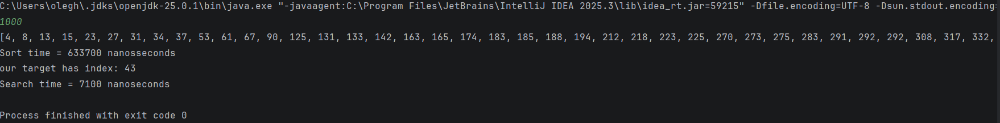

Assignment: Sorting and Searching Algorithm Analysis

A. Project Overview

I implemented 2 sorting algorithms and 1 searching algorithm:

Basic sorting algorithm: Bubble Sort, time complexity is O(n^2)  
Advanced sorting algorithm: Quick Sort, time complexity is O(n log n)  
Searching algorithm: Binary Search, time complexity is O(log n)

The goal of this project is to compare their performance using execution time.

B. Algorithm Descriptions

Bubble Sort  
Bubble Sort goes through the array multiple times and compares each element with the next one.  
If the left element is bigger than the right one, they are swapped.

This process repeats until the array is fully sorted.  
Because of repeated passes through the array, the time complexity is O(n^2).  
It is not efficient for large datasets.

Quick Sort  
Quick Sort is based on divide and conquer.  
It selects a pivot element and splits the array into two parts:
- elements smaller than pivot
- elements greater than pivot

Then the same process is repeated recursively for both parts.

On average, the array is divided into halves at each step (log n levels), and each level processes n elements.  
This gives a time complexity of O(n log n), which is much faster than Bubble Sort.

Binary Search  
Binary Search works only on sorted arrays.

It takes the middle element and compares it with the target value:
- if target is smaller, search continues in the left half
- if target is bigger, search continues in the right half

Each step reduces the search space by half.  
Because of this, the time complexity is O(log n), which is very efficient.

C. Experimental Results

Algorithm | Array Size | Input Type | Time (nanoseconds)  
Bubble Sort | 1000 | Random | ~5 815 900  
Quick Sort | 1000 | Random | ~485 300  
Binary Search | 1000 | Sorted | ~6600

D. 

Screenshots:
 - Bubble Sort  
 - Quick Sort

E. Reflection

After completing this assignment, I understood the difference between simple and efficient algorithms.

Bubble Sort is easy to implement but very slow for large arrays because of O(n^2) complexity.

Quick Sort is more complex, but much faster and works well with large datasets due to O(n log n) complexity.

Binary Search is very efficient, but it only works on sorted arrays.

Overall, this assignment helped me understand how important algorithm choice is for performance.